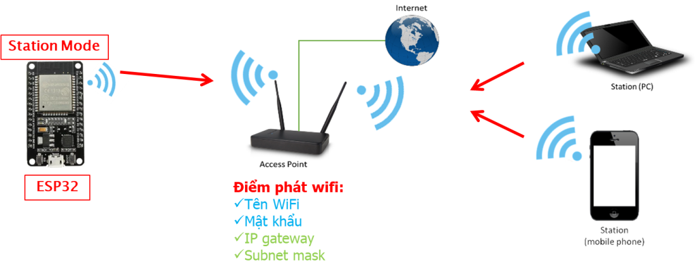

# D23_NguyenHuuHoangAnh

## BÁO CÁO NGHIÊN CỨU LAB NGÀY 26/10/2024

### A) CÔNG VIỆC ĐÃ LÀM
#### 1. Tìm hiểu chức năng Wifi trên ESP32
- Trước khi sử dụng chức năng Wifi tên ESP32 cần phải khai báo thư viện Wifi:
     ```cpp
          #include<Wifi.h>
     ```
- Các hàm điều khiển, quản lý kết nối Wifi trong thư viện Wifi.h
  - *i)* cấu hình chế độ Wifi
    ``` WiFi.mode(mode)```: Thiết lập chế độ Wi-Fi của ESP32.
  - *ii)* Kết nối mạng Wifi:
    ```
              WiFi.begin(ssid, password): Bắt đầu kết nối vào mạng Wi-Fi với tên (SSID) và mật khẩu.
              WiFi.disconnect(): Ngắt kết nối khỏi mạng Wi-Fi.
              WiFi.reconnect(): Thử kết nối lại với mạng Wi-Fi khi mất kết nối.
    ```
  - *iii)* Trạng thái và thông tin mạng Wi-Fi
    - Trạng thái:
    ``` 
           WiFi.status(): Trả về trạng thái kết nối
    ```
    
    - thông tin mạng:
     ```
           WiFi.localIP(): Lấy địa chỉ IP của ESP32 trong mạng Wi-Fi khi kết nối thành công.
           WiFi.macAddress(): Lấy địa chỉ MAC của ESP32.
           WiFi.RSSI(): Trả về cường độ tín hiệu của mạng đang kết nối.
      ```
  - *iv)* Cấu hình Access Point (AP)
    ```
    WiFi.softAP(ssid, password, channel, hidden, max_connection): Tạo mạng Wi-Fi Access Point.
     \*
     trong đó:
     ssid: Tên mạng.
     password: Mật khẩu.
     channel: Kênh Wi-Fi.
     hidden: Ẩn SSID (1 là ẩn, 0 là hiển thị).
     max_connection: Số thiết bị tối đa có thể kết nối.
    *\
    
     WiFi.softAPIP(): Lấy địa chỉ IP của ESP32 khi hoạt động ở chế độ Access Point.
     WiFi.softAPdisconnect(): Ngắt mạng Wi-Fi Access Point.
    ```
  - *v)* Quản lý thiết bị kết nối vào Access Point
    ```
          WiFi.softAPgetStationNum(): Trả về số lượng thiết bị đang kết nối vào Access Point.
          WiFi.softAPdisconnect(): Ngắt kết nối tất cả các thiết bị trong Access Point.
    ```
  - *vi)* Cấu hình IP tĩnh
     ```
     WiFi.config(local_ip, gateway, subnet)\\ Đặt địa chỉ IP tĩnh, gateway và subnet khi ESP32 hoạt động trong chế độ Station.
     ```
- Các chế độ Wifi của ESP32
  - Thiết lập chế độ cho ESP:
       ```cpp
            Wifi.mode(WIFI_STA) // chế độ Station
            Wifi.mode(WIFI_AP)  // chế độ Access Point
            Wifi.mode(WIFI_AP_STA) // đồng thời cả 2 chế độ Station & Access Point 
       ```
       
  - Station Mode:
      - ở chế độ này ESP kết nối với mạng wifi khác với vai trò như thiết bị khách. Trong trường hợp này, bộ định tuyến sẽ chỉ định một địa chỉ IP duy nhất cho ESP . Ta có thể giao tiếp với ESP bằng các thiết bị khác được kết nối với cùng một mạng bằng cách tham chiếu đến địa chỉ IP của ESP.
         
       - Cách thiết lập chức năng Station và kết nối với mạng WIFI hiện có:
  ```cpp
     #include <WiFi.h>  //Thêm thư viện wifi
     const char* ssid = "Xuong"; //Tên điểm phát wifi
     const char* password = "68686868";//Mật khẩu wifi
      
     void setup(){
         Serial.begin(115200);
         WiFi.mode(WIFI_STA);  //Thiết lập chế độ wifi STA
         WiFi.begin(ssid, password); //Thực hiện kết nối với mạng Wifi theo tên và password
         Serial.println("\nConnecting to WiFi Network ..");
  
         while(WiFi.status() != WL_CONNECTED){  // hiện ra serial các dấu chấm chờ kết nối
             Serial.print(".");
             delay(100);
         }
         Serial.println("\nConnected to the WiFi network");
         Serial.print("Local ESP32 IP: "); 
         Serial.println(WiFi.localIP()); //In địa chỉ IP của ESP được bộ định tuyến cấp phát
     }  
     void loop(){
     }
  ```
  - Access Point Mode:
     - ở chế độ này, ESP hoạt động với vai trò là một điểm truy cập, các thiết bị khác có thể giao tiếp, điều khiển ESP thôgn qua mạng cục bộ của nó,
       
     - Cách thiết lập chế độ Access Point:
```cpp
     #include <WiFi.h> //Thêm thư viện wifi
     const char* ssid = "ESP32_AP"; //Tên wifi ESP phát ra
     const char* password = "12345678";//Mật khẩu wifi
     void setup() {
       Serial.begin(115200);
       WiFi.mode(WIFI_OFF);//Tắt wifi trước khi khi khởi tạo
       delay(100);
       WiFi.mode(WIFI_AP); //Thiết lập chế độ wifi AP
       delay(1000);
       if(!WiFi.softAP(ssid,password)){ //Thực hiện phát wifi
         Serial.println("Wifi AP fail!");
         while(1);
       }
       Serial.println("WiFi AP started!");
       Serial.print("IP host:");
       Serial.println(WiFi.softAPIP()); //In đại chỉ IP host của ESP
     }
     void loop() {
     }

```
  - Station và Access Point:
     - Chế độ này ESP hoạt đồng thời cả 2 chức năng vừa làm điểm truy cập vừa kết nối với mạng Wifi hiện có
       
     - Cách thiếp lập chế độ :
```cpp
     #include <WiFi.h>  //Thêm thư viện wifi
     const char* ssid = "Xuong"; //Tên điểm truy cập wifi
     const char* password = "68686868"; //Mật khẩu wifi
     
     const char* ssidAP = "ESP32_AP";  //Tên wifi cần phát ra
     const char* passwordAP = "12345678"; //Mật khẩu wifi
      
     void setup(){
         Serial.begin(115200);
      
         WiFi.mode(WIFI_AP_STA); //Thiết lập chế độ wifi STA+AP đong thời
     
         WiFi.begin(ssid, password); //Kết nối wifi
         Serial.println("\nConnecting to WiFi Network ..");
         while(WiFi.status() != WL_CONNECTED){
             Serial.print(".");
             delay(100);
         }
         Serial.println("\nConnected to the WiFi network");
         Serial.print("Local ESP32 IP: ");
         Serial.println(WiFi.localIP()); //In địa chỉ IP của ESP được bộ định tuyến cấp phát
     
         int channel = WiFi.channel(); //Đọc kênh wifi đã kết nối

         //Phát wifi trên kênh đã kết nối
         if(!WiFi.softAP(ssidAP, passwordAP,channel)){ 
           Serial.println("Soft AP creation failed.");
           while(1);
         }
         Serial.println("\nSuccessfully created soft AP");
         Serial.print("AP IP address: ");
         Serial.println(WiFi.softAPIP());//In địa chỉ IP host
     }
      
     void loop(){
     }

```
- Quét mạng wifi
  - ESP có thể quét thể quét các mạng wifi có trong phạm vi của nó.
    ```cpp
          #include "WiFi.h"
          void setup() {
            Serial.begin(115200);
            WiFi.mode(WIFI_STA); // thiết lập chế độ station để esp truy cập mạng
          }
          
          void loop() {
            Serial.println("scan start");
            int n = WiFi.scanNetworks(); // trả về số lượng mạng wifi quét được
            Serial.println("scan done");
            if (n == 0) {
                Serial.println("no networks found");
            } else {
              Serial.print(n);
              Serial.println(" networks found");
              for (int i = 0; i < n; ++i) {
                // in ra Serial SSID và RSSI của wifi quét 
                Serial.print(i + 1);
                Serial.print(": ");
                Serial.print(WiFi.SSID(i)); // tên wifi
                Serial.print(" (");
                Serial.print(WiFi.RSSI(i)); // cường độ tín hiệu
                Serial.print(")");
                Serial.println((WiFi.encryptionType(i) == WIFI_AUTH_OPEN)?" ":"*"); // kiểm tra loại mã hóa của mạng: * là có mã hóa
                delay(10);
              }
            }
            delay(2000); // delay 2 giây mỗi lẫn quét
          }
    ```

- 
