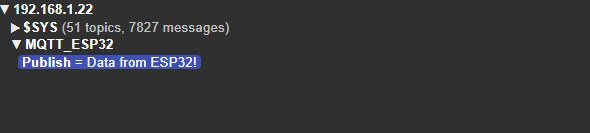

# D23_Nguyen Huu Hoang Anh
# Báo cáo nghiên cứu Lab ngày 12/01/2024
## A) Công việc đã làm 
### 1) Nhận tài liệu và tìm hiểu về MQTT
- Các link tài liệu được nhận:
  - <https://www.emqx.com/en/mqtt/public-mqtt5-broker>
  - <https://viblo.asia/p/mqtt-la-gi-vai-tro-cua-mqtt-trong-iot-V3m5WL3bKO7>
  - <https://github.com/knolleary/pubsubclient>
  - <https://khuenguyencreator.com/lap-trinh-esp32-mqtt-bat-tat-den-voi-hivemq-broker/#google_vignette>
  - <https://www.iotzone.vn/esp32/esp32-co-ban/mqtt-esp32-cho-nguoi-moi/>
  - <https://www.emqx.com/en/blog/esp32-connects-to-the-free-public-mqtt-broker>
  - <https://www.mqtt-dashboard.com/>

### 2) Tìm hiểu giao thức MQTT
  - **Khái niệm giao thức MQTT:** là giao thức truyền thông theo mô hình publish/subscribe , được sử dụng cho các thiết bị IoT với băng thông thấp, độ tin cậy cao và khả năng được sử dụng trong mạng lưới không ổn định.
  
    - **MQTT broker**:
      được coi như trung tâm trung gian, nhận bản tin từ publisher hoặc chia sẻ bản tin cho các Client kết nối tới.
    - **MQTT client:** 
      là thiết bị ngoại vi kết nối tới MQTT broker để Publish hoặc Subscribe bản tin với các topic bản tin cụ thể.
  - **các mức độ tin cậy truyền thông:**
    Có 3 mức độ tin cậy :
    - QoS 0: Broker/client sẽ gửi dữ liệu đúng một lần, quá trình gửi được xác nhận bởi chỉ giao thức TCP/IP.
    - QoS 1: Broker/client sẽ gửi dữ liệu với ít nhất một lần xác nhận từ đầu kia, nghĩa là có thể có nhiều hơn 1 lần xác nhận đã nhận được dữ liệu
    - QoS 2: Broker/client đảm bảo khi gửi dữ liệu thì phía nhận chỉ nhận được đúng một lần, quá trình này phải trải qua 4 bước bắt tay.
  
  - **Các thành phần chính và cách hoạt động**:
  - 
    
  - **Nguyên lý :**
  - 

   Broker sẽ đóng vai trò trung gian, nhận các bản tin từ các Publisher Client và đưa vào các topic cụ thể, các Subscriber Client sẽ lấy dữ liệu, bản tin ở các topic 
  

### 3) Khởi chạy MQTT Broker trên máy tính.
- sau khi tải MQTT Mosquitto và phần mềm MQTT Explorer ta tiến hành chạy MQTT:
Mở commanPromt chạy lệnh dẫn tới file mosquitto :
```cpp
    cd D:\mosquitto 
```
Nhập lệnh chạy mosquitto :
```cpp
  net start mosquitto
```
khi có thông báo  ```The Mosquitto Broker service was started successfully. ``` nghĩa là đã chạy thành công Broker; 

- Gửi bản tin lên Broker.
  chạy lệnh sau để gửi bản tin lên broker:
  ```cpp
    mosquitto_pub -h localhost -t test/topic -m "Hello world"
   // trong đó vị trí localhost là địa chỉ IP máy chủ đang chạy broker. 
  ```
  mở phần mềm MQTT Explorer và nhập các thông tin như sau:

  
  Bản tin đựoc gửi có thể được xem thông qua MQTT Explorer:

  
### 4)  Thực hành với ESP32
#### 4.1) Publish bản tin từ ESP lên Broker
- Sau khi installed các thư viện như PubSubClient ta tiến hành nạp code cho ESP như sau:
  - Setup wifi và địa chỉ ip Broker cho ESP
    ```cpp
          #include <WiFi.h>
          #include <PubSubClient.h>
          // Thông tin mạng Wi-Fi
          const char* ssid = "Xuong";       // Thay bằng tên Wi-Fi của bạn
          const char* password = "68686868";      // Thay bằng mật khẩu Wi-Fi của bạn

          // Thông tin MQTT broker
          const char* mqtt_server = "192.168.1.22";   // Địa chỉ IP của máy tính chạy broker
          const int mqtt_port = 1883;                  // Cổng MQTT (thường là 1883)

          // Tạo WiFi và MQTT client
          WiFiClient espClient;
          PubSubClient client(espClient);

          void setup_wifi() {  // kết nối với wifi
            Serial.println("Connecting to Wi-Fi..."); // hiển thị quá trình kết nối wifi trên Serial
            WiFi.begin(ssid, password);

            while (WiFi.status() != WL_CONNECTED) { 
              delay(1000);
              Serial.print(".");
            }
            Serial.println("\nWiFi connected!");
          }

          void connect_to_mqtt() {  // kết nối với broker MQTT
            while (!client.connected()) {
              Serial.print("Connecting to MQTT Broker...");
              if (client.connect("ESP32_Client")) {
                Serial.println("connected!");
                client.subscribe("MQTT_ESP32/Publish"); // đăng kí, khởi tạo topic 
              } else {
                Serial.print("failed, rc="); 
                /* nếu không thể kết nối tớ broker thì hiển thị mã lỗi 
                -4: Mất kết nối.
                -3: Broker không phản hồi.
                -2: DNS không tìm thấy broker.
                -1: Kết nối thất bại.
                0: Kết nối thành công.*/
 
                Serial.println(client.state());
                delay(2000);
              }
            }
          }
          void setup() {
            Serial.begin(115200);
            setup_wifi();
            client.setServer(mqtt_server, mqtt_port);
          }
    ```
  - Publisch bản tin từ ESP lên Broker:
    ```cpp
        void loop() {
        if (!client.connected()) { // nếu chưa kết nối được broker sẽ tiếp tục retryretry
          connect_to_mqtt();
        }
        client.loop(); // hàm xử lí kết nối và bản tin đến broker.

        // Gửi tin nhắn mỗi 33 giây
        static unsigned long lastMsg = 0;
        unsigned long now = millis();
        if (now - lastMsg > 3000) {
          lastMsg = now;
          String msg = "Data from ESP32!";
          client.publish("MQTT_ESP32/Publish", msg.c_str()); // publish 1 chuỗi string msg đến topic MQTT_ESP32/Publish.
          Serial.println("Message sent: " + msg);
        }
      }
    ```
- Sau khi nạp code ta thu được kết quả mỗi 3 giây broker sẽ nhận được tin nhắn từ ESP như sau :
    ;
#### 4.2) Subscribe bản tin từ Broker về ESP
- Lúc này ESP đóng vai trò vừa là Publisher Client vừa là Subscriber Client.
  - tiếp tục sử dụng code Publish ở trên và code thêm phần Sub bản tin về ESP:
  ```cpp
    void myCallBack(char * topic, byte * payload, unsigned int lenght){
    Serial.print(topic);
    String message = "";
    for(int i=0; i<lenght  ; i ++){
      message += (char)payload[i];
    }
    Serial.println(" ---> message that you send from publisher: " + message);
  }

  void setup() {
    Serial.begin(115200);
    setup_wifi();
    client.setServer(mqtt_server, mqtt_port);
    client.setCallback(myCallBack);
  }
  ```
  - khi hàm ``` client.loop() ``` chạy thì nó sẽ duy trì kết nối Client tới broker và thực hiện các tác vụ xử lí tin nhắn như Callback tin nhắn được gửi tới các topic đã đăng kí cho ESP.
- Sau khi nạp code thu được kết quả :
  

#### 4.3) Điều khiển đèn từ xa
- Gửi tin hiệu điều khiển ON/OFF từ nút bấm lên Broker
  - sử dụng một client khác (ESP8266) kết nối tới broker, đọc trạng thái button, và gửi lệnh điều khiển lên broker. Ta có code như sau :
    - hàm ngắn để kiểm tra trạng thái Button trong khi vòng loop vẫn chạy.
    ```cpp
    void IRAM_ATTR countPressing() {
    static unsigned long lastInterruptTime = 0; // Thời gian xảy ra ngắt lần cuối
    unsigned long interruptTime = millis();    // Thời gian hiện tại

    // Nếu thời gian giữa hai lần ngắt lớn hơn ngưỡng debounce
    if (interruptTime - lastInterruptTime > 50) { 
      pressCount++; // Tăng biến đếm
    }
    lastInterruptTime = interruptTime; // Cập nhật thời gian ngắt cuối
   }
    void setup() {
    pinMode(4,INPUT_PULLUP);
    Serial.begin(115200);
    setup_wifi();
    client.setServer(mqtt_ip_server, mqtt_port);
    attachInterrupt(digitalPinToInterrupt(buttonPin), countPressing , FALLING);
    }
  ```
- Gửi tín hiệu button lên Broker để điều khiển đèn
```cpp
  if(pressCount >= 2 ) pressCount = 0; // nếu số lần bấm từ 2 trở lên thì reset về 00
  Serial.println(pressCount);
  client.publish("MQTT_ESP32/ButtonCommand",String(pressCount).c_str());
```
- Dùng một Client khác (ESP32) kết nối với Broker, lấy tín hiệu điều khiển từ broker để điều khiển đèn nhưu sau :
```cpp
      void mycallBack(char * topic, byte * payload, unsigned int lenght){

        String message = "";
        for(int i=0; i<lenght  ; i ++){
          message += (char)payload[i];
        }
      if(String(topic) == "MQTT_ESP32/ButtonCommand"){
          if(message == "1"){
            Serial.println("Status of the LED : ON");
            ledStatus = true;
            String s = "ON";
            client.publish("MQTT_ESP32/Publish", s.c_str());
          }
          else{
            Serial.println("Status of the LED : OFF");
            ledStatus = false;
            String s = "OFF";
            client.publish("MQTT_ESP32/Publish", s.c_str());
          }
          
        }


      }
```
- Điều khiển đèn chạy :
```cpp
void loop() {
  if (!client.connected()) {
    connect_to_mqtt();
  }
  client.loop();
if(ledStatus == true){
  digitalWrite(ledPin, HIGH);

}
else {
  digitalWrite(ledPin,LOW);
}
}
```
#### 4.4) Hiển thị thông tin nhiệt độ, độ ẩm
- Gửi thông tin cảm biến lên Broker
  - Sử dụng ESP8266 đọc cảm biến DHT11:
  ```cpp
      void loop() {
      if (!client.connected()) {
        connect_to_MQTT();
      }
      client.loop();
      int t = 0;
      int h = 0;
      int result = dht11.readTemperatureHumidity(t,h);
      if(result == 0){
            Serial.print("Temperature: ");
            Serial.print(t);
            Serial.print(" °C\tHumidity: ");
            Serial.print(h);
            Serial.println(" %");
            String tmp = "Temperature: " + String(t) + "oC";
            String hmd = "Humidity: " + String(h) + "%";
            client.publish("MQTT_ESP32/DHT11_tmp", tmp.c_str());
            client.publish("MQTT_ESP32/DHT11_hmd", hmd.c_str());
      }
    }
  ```
  - trên broker sẽ hiển thị thông tin như sau :
  
- chạy các hàm setup của I2C và màn LCD :
```cpp
    void setup() {
      pinMode(ledPin,OUTPUT);
      Serial.begin(115200);
      setup_wifi();
      client.setServer(mqtt_server, mqtt_port);
      client.setCallback(mycallBack);
      Wire.begin(21,22);
      lcd.begin(16, 2);
      lcd.backlight(); // Bật đèn nền
    }

```
- Lấy dữ liệu và in ra trên serial và màn hình LCDLCD với một Client khác kết nối với Broker (ESp32).
```cpp
    void mycallBack(char * topic, byte * payload, unsigned int lenght){

      String message = "";
      for(int i=0; i<lenght  ; i ++){
        message += (char)payload[i];
      }
    if (String(topic) == "MQTT_ESP32/DHT11_tmp") {
      Serial.println(message);
      lcd.setCursor(0, 0);
      lcd.print(message);
    } 
    else if (String(topic) == "MQTT_ESP32/DHT11_hmd") {
      Serial.println(message);
      lcd.setCursor(0, 1);
      lcd.print(message);
    }
    }
```
#### 4.5) Video demo 
- [Link video Demo](https://youtu.be/PYXvsqj0Yts)
#### 4.6) Link code
- ESP8266 (client 1)
  [code Client1](https://github.com/ptitopen-git/D23_NguyenHuuHoangAnh/blob/main/Lab_Report_2024/Report%20of%2020241116/ESP8266_DHT11_MQTT_Broker.ino)
- ESP32 (client 2)
  [code Client2](https://github.com/ptitopen-git/D23_NguyenHuuHoangAnh/blob/main/Lab_Report_2024/Report%20of%2020241116/MQTT_ESP.ino)

## B) Công việc tiếp theo 
- Tiếp tục tìm hiểu về giao thức MQTT và thực hành với ESP 
## C) Linh kiện mượn của Lab 
- Không

