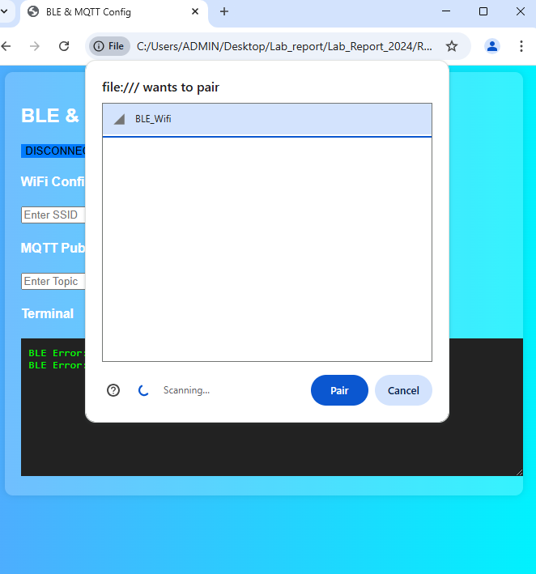
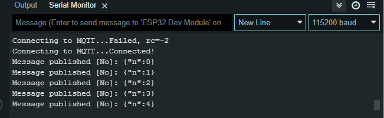

# D23_Nguyen Huu Hoang Anh
# Báo cáo nghiên cứu Lab ngày 01/03/20252025
## A) Công việc đã làm 
- Nhận và đọc báo cáo WEB BLE
- Hiểu nguyên lý họat động giao tiếp giữa Web và ESP thông qua BLE
- Tạo thêm chức năng publish bản tin lên MQTT Broker trên giao diện web 
### 1) Nhận báo cáo của anh Cảnh về webBLE
- **Link báo cáo**: 
  - <https://github.com/eleptit-club/ELE-D22-NguyenDucCanh/tree/main/ESP/LAB>
### 2) Nắm nguyên lý hoạt động config WiFi qua BLE, sau khi kết nối được WiFi gửi message MQTT
- **Nguyên lý hoạt động của code** 
  - Sơ đồ nguyên lý :
    
- **Lưu ý lỗi *sketch too big***
  Khi bị thông báo lỗi *sketch too big* thì cần vào tool --> partition scheme --> đổi sang: Huge App (3MB no OTA / 1MB SPIFFS)


### 3) Nguyên lý Web_BLEWifi và ESP 
Ngoài việc sử dụng thẻ lệnh HTML để tạo giao diện người dùng, hệ thống còn sử dụng các hàm JavaScript để xử lý và gửi dữ liệu qua giao thức Bluetooth Low Energy (BLE).
- **Khai báo dịch vụ và đặc tính**
  ```cpp
        var deviceName = 'BLE_Wifi';  // tên thiết bị kết nối ble 
        var bleService = "0000181f-0000-1000-8000-00805f9b34fb"; // định nghĩa uuid dịch vụ ble 
    
        // UUID cho từng characteristic
        var wifiCharacteristicUUID = "6e400002-b5a3-f393-e0a9-e50e24dcca9e"; // WiFi config
        var messageCharacteristicUUID = "6e400002-b5a3-f393-e0a9-e50e24dcca9e"; // MQTT message
    
  ```
- **Quét các thiết bị và kết nối với ESP bằng BLE**
  ```cpp
          function requestBluetoothDevice() {
            // hiển thị hộp thoại để chọn thiết bị BLE 
            // chỉ quét các thiết bị có tên nhưu đã đăng kí 
            navigator.bluetooth.requestDevice({ 
                filters: [{ name: deviceName }],
                optionalServices: [bleService] }) // đăng ksi dịch vụ để có thể truy cập các đặc tính bên trong 

            .then(device => {
                dev = device; 
                return device.gatt.connect();
            })
            .then(server => server.getPrimaryService(bleService)) // truy cập dịch vụ BLE 
            .then(service => {
                // Lấy từng characteristic BLE
                return Promise.all([
                    service.getCharacteristic(wifiCharacteristicUUID).then(char => wifiCharacteristic = char),
                    service.getCharacteristic(messageCharacteristicUUID).then(char => messageCharacteristic = char)
                ]);
            })// chờ khi lấy được hết tất cả các đặc tính đã khai báo trước đó , nếu lấy được hết thì báo BLE đã kết nối thành công 
            .then(() => {
                log("BLE connected! Ready to send data.");
            })
            .catch(error => log("BLE Error: " + error));
        }
  ```
  Giao diện quét các thiết bị như sau 
  
- **Hàm config và gửi dữ liệu WIFI từ ô nhập liệu**
  ```cpp
          function ConnectWifi() {
            if (!wifiCharacteristic) { // nếu đặc tính không đúng , khôgn tìm thấy thì báo lỗi 
                log("WiFi characteristic not found!");
                return;
            }
            var ssid = document.getElementById("SSID").value; // lấy dữ liệu từ ô SSID
            var password = document.getElementById("Password").value; // lấy dữ liệu từ ô PASSWORD 
            // đóng gói dữ liệu và gửi tới ESP thôgn qua đặc tính đã đăng kí 
            if (ssid && password) {
                var data = new TextEncoder().encode("WIFI:"+ ssid + ";" + password);
                wifiCharacteristic.writeValue(data)  // gửi dữ liệu wifi dưới dạng định danh : WIFI:___:___
                    .then(() => log("WiFi credentials sent successfully"))
                    .catch(error => log("WiFi send error: " + error));
            } else {
                log("Please enter both SSID and Password!");
            }
        }
  ```
  Sau khi nhập liệu và gửi thì sẽ có thôgn báo trên terminal web như sau : 
  
- Đối với ESP , sẽ có các hàm tiếp nhận thông tin, kết nối wifi thông qua thông tin nhận được từ Web
  - *Đăng kí dịch vụ và đặc tính BLE*
  ```cpp
    #define BatteryService BLEUUID((uint16_t)0x181F)  // Định nghĩa UUID cho dịch vụ BLE

    // Định nghĩa UUID cho đặc tính BLE
    BLECharacteristic BatteryLevelCharacteristic(
        BLEUUID((uint16_t)0x2A18), 
        BLECharacteristic::PROPERTY_READ | BLECharacteristic::PROPERTY_WRITE | BLECharacteristic::PROPERTY_NOTIFY
    );
      
    // Bộ mô tả đặc tính BLE
    BLEDescriptor BatteryLevelDescriptor(BLEUUID((uint16_t)0x2901));

    // Định nghĩa UUID cho characteristic nhận dữ liệu (ESP)
    #define CHARACTERISTIC_UUID_RX "6E400002-B5A3-F393-E0A9-E50E24DCCA9E"

  ```
  - *Khởi tạo BLE*
  ```cpp
  void InitBLE() {
    BLEDevice::init("BLE_Wifi"); // Khởi tạo BLE với tên thiết bị là "BLE_Wifi"
    pServer = BLEDevice::createServer(); // Tạo server BLE trên ESP32
    pServer->setCallbacks(new MyServerCallbacks()); // Gắn callback xử lý kết nối BLE
    pBattery = pServer->createService(BatteryService); // Tạo dịch vụ BLE với UUID 0x181F

    pBattery->addCharacteristic(&BatteryLevelCharacteristic); // Thêm đặc tính BLE vào dịch vụ
    BatteryLevelDescriptor.setValue("Percentage 0 - 100"); // Mô tả đặc tính
    BatteryLevelCharacteristic.addDescriptor(&BatteryLevelDescriptor);
    BatteryLevelCharacteristic.addDescriptor(new BLE2902()); // Cho phép gửi thông báo (notify)

    // Tạo đặc tính nhận dữ liệu từ Web BLE
    BLECharacteristic *pWriteCharacteristic = pBattery->createCharacteristic(
        CHARACTERISTIC_UUID_RX, BLECharacteristic::PROPERTY_WRITE
    );
    pWriteCharacteristic->setCallbacks(new MyCallbacks()); // Gắn callback xử lý dữ liệu nhận

    pServer->getAdvertising()->addServiceUUID(BatteryService); // Bật quảng bá BLE
    pBattery->start();
    pServer->getAdvertising()->start();
    }
  ```
  - *Hàm nhận và xử lí dữ liệu Web BLE*
```cpp

        class MyCallbacks: public BLECharacteristicCallbacks {
      void onWrite(BLECharacteristic *pCharacteristic) {
        std::string rxValue = std::string(pCharacteristic->getValue().c_str());
        if (rxValue.length() > 0) {
          Serial.print("Received Value: ");
          Serial.println(rxValue.c_str());
        }

        // Phân tách dữ liệu nhận được
        String receivedData = String(rxValue.c_str());
        receivedData.trim();
        size_t delimiterPos = receivedData.indexOf(':');

        if (delimiterPos != -1) {
          String check = receivedData.substring(0, delimiterPos);

          if (check == "MQTT") { // Nếu dữ liệu là MQTT
            String mqttData = receivedData.substring(delimiterPos + 1);
            size_t delimiterPos2 = mqttData.indexOf(';');
            if (delimiterPos2 != -1) {
              topic = mqttData.substring(0, delimiterPos2);
              message = mqttData.substring(delimiterPos2 + 1);
            } else {
              topic = mqttData;
              message = "";
            }

            // Gửi tin nhắn lên MQTT Broker
            if (client.connected()) {
              publishMessage(topic.c_str(), message, false);
            } else {
              Serial.println("MQTT not connected, trying to reconnect...");
              MQTT_Connect();
            }
          }
        }
      }
    };
```
Khi có tin nhắn gửi đến esp , nếu định dạng đúng là bản tin gửi lên broker thì ESP sẽ xử lí dữ liệu và in lên broker như sau :


Và bên trong broker sẽ có tin nhắn vừa publish:


- **Kết nối Web và ESP thông qua BLE**
    - ESP32 tạo BLE Server và Service với các đặc tính (characteristics).
    - Web BLE Client kết nối tới ESP32 thông qua hàm ```requestBluetoothDevice()```  
    - Web gửi thông tin WiFi và MQTT (SSID, password, topic) qua BLE bằng hàm ``` connectWifi``` 
    - ESP32 nhận thông tin này và kết nối WiFi bằng hàm onWrite để nhận receivedData và dùng hàm ```receieData()``` để tách lấy ssid và password , sau đó dùng thông tin này để kết nối wifi bằng hàm ```Wifi.begin(ssid,pass);```
    - Sau khi nhận thông tin thì wifi sẽ được kết nối và in thông tin ra màn hình Serial 
  
  sau khi kết nối wifi, esp sẽ kết nối với MQTT Broker và gửi tin nhắn từ 1 đến 100 với topic No. 
  

### 4) **Thêm chức năng xem và publish từ web lên mqtt thông qua esp**
- **Về phía Web BLE**
  - Sửa trong code hoạt động của Web 
    - Đăng kí thêm đặc tính gửi dữ liệu bản tin publish lên MQTT Broker 
```cpp
  var messageCharacteristicUUID = "6e400002-b5a3-f393-e0a9-e50e24dcca9e"; // MQTT message 
```  
   - Thêm 2 ô nhập liệu để publish tin nhắn tới MQTT Broker 
  
   - Thêm hàm publish để gửi dữ liệu tới ESP và publish lên Broker 
```cpp
        function publishMessage() {
            if (!messageCharacteristic) { // nếu k tìm thấy đặc tính đã cài đặt thì báo lỗi 
                log("MQTT message characteristic not found!");
                return;
            }
            // lấy dữ liệu từ 2 ô nhập liệu topic và message 
            let topic = document.getElementById("mqttTopic").value;
            let message = document.getElementById("mqttMessage").value;
    
            if (topic && message) {
                let data = new TextEncoder().encode("MQTT:" + topic + ";" + message);
                messageCharacteristic.writeValue(data) // gửi dữ liệu MQTT  với định dạng MQTT:__;___
                    .then(() => log("Topic & Message sent successfully"))
                    .catch(error => log("Send error: " + error));
            } else {
                log("Please enter both Topic and Message!");
            }
        }
    
```
- **Phía ESP**
- Sửa hàm onWrite để có thể phân tích dữ liệu MQTT được Web gửi tới:
  - Thêm đoạn phân tích và tách nếu dữ liệu nhận được đúng định dạng bản tin MQTT.
  ```cpp
  // Phân tách dữ liệu nhận được
        String receivedData = String(rxValue.c_str());
        receivedData.trim();
        size_t delimiterPos = receivedData.indexOf(':');

        if (delimiterPos != -1) {
          String check = receivedData.substring(0, delimiterPos);

          if (check == "MQTT") { // Nếu dữ liệu là MQTT
            String mqttData = receivedData.substring(delimiterPos + 1);
            size_t delimiterPos2 = mqttData.indexOf(';');
            if (delimiterPos2 != -1) {
              topic = mqttData.substring(0, delimiterPos2);
              message = mqttData.substring(delimiterPos2 + 1);
            } else {
              topic = mqttData;
              message = "";
            }
  ```
  - Mỗi khi web gửi dữ liệu đến esp thì hàm onWrite sẽ đọc , nếu địng dạng dữ liệu là kiểu MQTT:topic;message thì sẽ được hiểu là dữ liệu publish và esp sẽ tách lấy topic và message để publish lên Broker. 
  - Code sau khi sửa lại để có thể publish tin nhắn lên Broker
    - [code](https://github.com/ptitopen-git/D23_NguyenHuuHoangAnh/blob/main/Lab_Report_2024/Report%20of%2020250301/ESP32_BLE_MQTT/ESP32_BLE_MQTT.ino)
  
  
  
### 5) Video demo 
- **Link video** 
   [video demo](https://youtu.be/o9ese3CqDt4)

## B) Công việc tiếp theo
## C) Linh kiện mượn của Lab 
- Không 